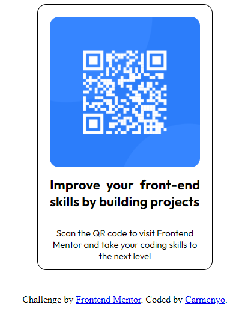

Pureref.com
BEM
Mobile First

Este ejercicio consiste en la maquetación de un QR Code

Live Site URL: [https://carmenyo.github.io/QRCodeComponent-FrontendMentor/]

Construido con:
- Semantic HTML5 markup
- CSS custom properties
- Mobile-first workflow

What I learned:
Practice layout.

Continued development:

Improve elements position.

Author

- Frontend Mentor - [@Carmenyo](https://www.frontendmentor.io/profile/@Carmenyo)
- Twitter - [@CarmenC51600212](https://www.twitter.com/@CarmenC51600212)
