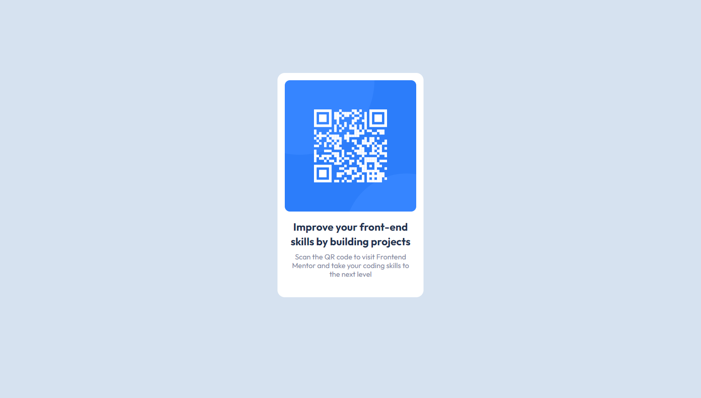

# Frontend Mentor - QR code component solution

This is a solution to the [QR code component challenge on Frontend Mentor](https://www.frontendmentor.io/challenges/qr-code-component-iux_sIO_H). Frontend Mentor challenges help you improve your coding skills by building realistic projects. 

## Table of contents

- [Overview](#overview)
  - [Screenshot](#screenshot)

- [My process](#my-process)
	- [Built with](#built-with)
	- [What I learned](#what-i-learned)
- [Author](#author)

## Overview

### Screenshot

## My process

### Built with

- Semantic HTML5 markup
- SASS
- REACT

### What I learned

"I had already completed this challenge in HTML and CSS, but now I have decided to take it a step further and write my code in REACT, using SASS and utilizing the BEM terminology. I have also attempted to achieve Pixel Perfect."

## Author

- Frontend Mentor - [@Carmenyo](https://www.frontendmentor.io/profile/Carmenyo)

